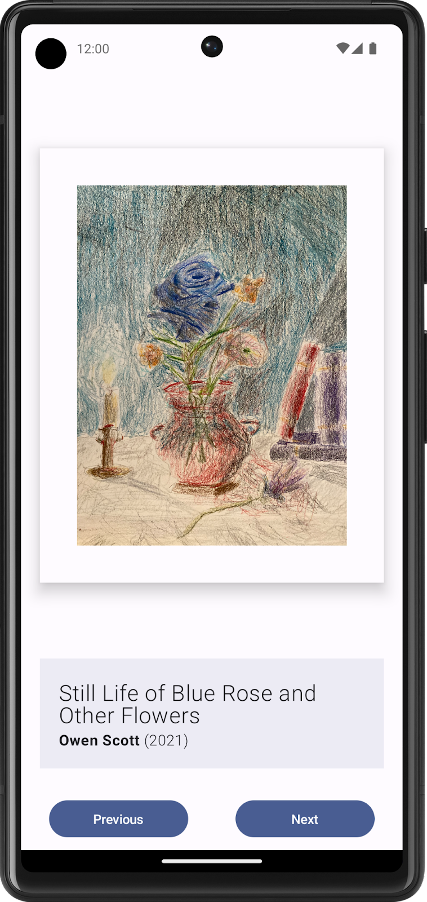
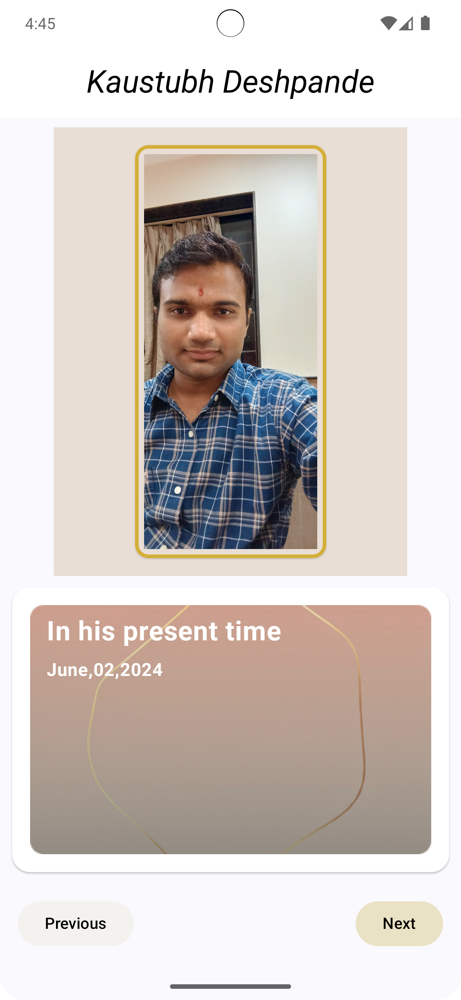
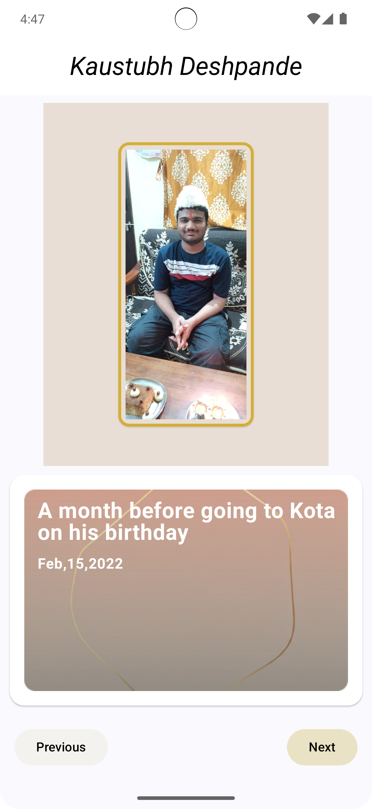
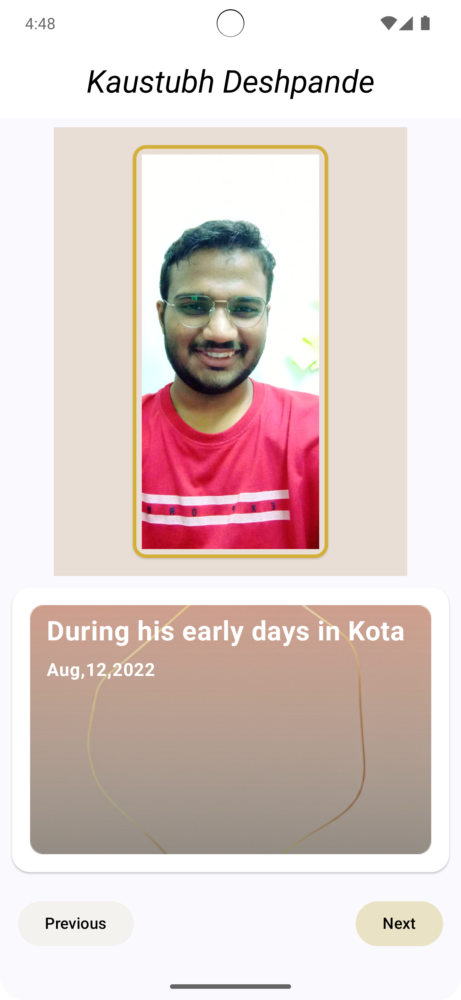
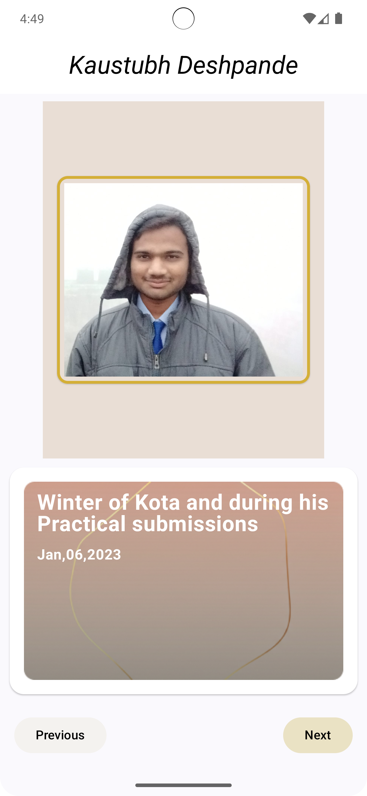

# 🎨 Art Space App

This app was created as part of the **Android Basics with Compose Challenge**:  
[Art Space Codelab](https://developer.android.com/codelabs/basic-android-kotlin-compose-art-space).

It expands upon the challenge requirements with **enhanced UI design**, **smooth navigation logic**, and **Figma-based refinements**.

---

## 📜 Overview
Art Space allows users to **browse digital artwork**, **navigate seamlessly**, and experience a **modernized UI** built entirely with **Jetpack Compose**.

The original challenge specified a **basic UI**, which has now been improved using **Material 3 components**, **Stitch AI refinements**, and **aesthetic adjustments from Figma**.

---

## 🚀 Features
- 🖼️ **Next & Previous Navigation** – Smooth transitions between artworks
- 🎨 **Typography Styling** – Uses `MaterialTheme.typography` for polished text rendering
- 🔄 **Looping Logic** – Circular navigation through images
- 📱 **Optimized for Different Screen Sizes** – UI adapts dynamically
- 🖌️ **Stitch AI & Figma Integration** – Enhancing UI clarity

---

## 🛠️ Tech Stack
- **Jetpack Compose** ✨
- **Kotlin** 🚀
- **Material 3 Components** 📱
- **Stitch AI (UI Enhancement)** 🎭
- **Figma (Design Refinement)** 🎨

---

## 📷 Challenge UI vs. Created UI

### **Challange UI vs. UI Created**
<table>
  <tr>
    <th>Challenge UI (Given)</th>
    <th>UI Created (Modified)</th>
  </tr>
  <tr>
    <td></td>
    <td></td>
  </tr>
</table>

### **Artwork Preview Grid**
<table>
  <tr>
    <td></td>
    <td></td>
    <td></td> 
    <td></td>
  </tr>
</table>

---
